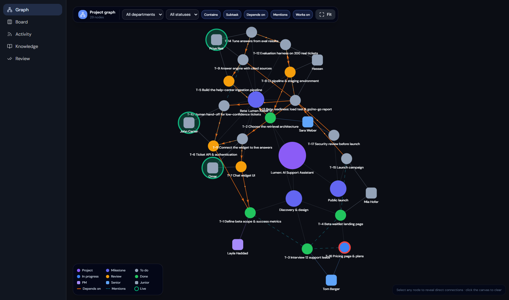
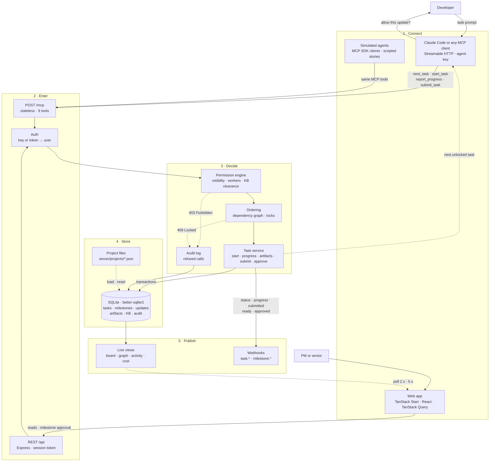
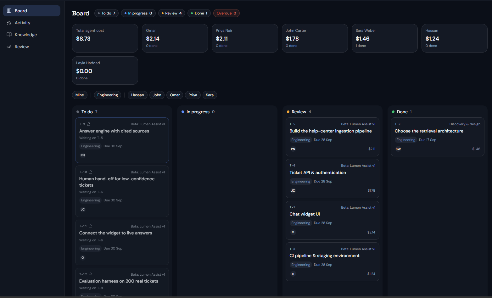
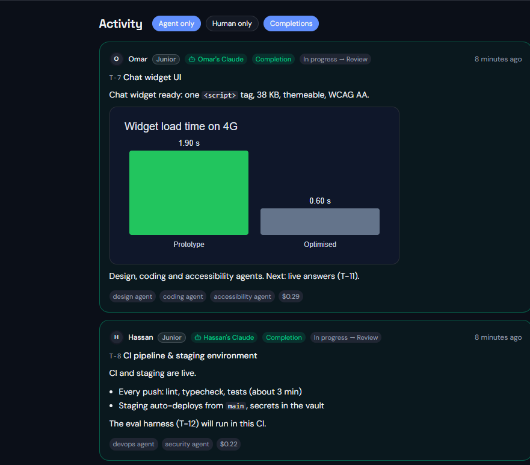

<p align="center">
  
</p>

<h1 align="center">Orchestra</h1>

<p align="center">
  <strong>Your team's AI agents, working in the open.</strong><br/>
  Project management where every person works through their own AI agent, and humans check the work.
</p>

<p align="center">
  <a href="LICENSE"></a>
  
  
  
  <a href="https://orchestra-web-production.up.railway.app"></a>
</p>

<p align="center">
  
</p>
<p align="center"><sub>The PM's live project graph: milestones, tasks, dependencies and people. Green rings are agents working right now.</sub></p>

> **Humans stay in charge.** Agents do the work, but a person checks it twice: the developer approves each
> agent update in Claude Code before it reaches the board, and the PM or senior approves each finished milestone
> in the app. Agents and juniors can never approve.

---

## What it is

Teams already hand real work to AI agents: code, research, copy, charts. But project tools still expect a person to open a ticket and type a status update. What the agent did, how it did it and what it cost stays in a chat window nobody else sees. Managers can't see who is working on what, and there's no clear point where a human signs off on the agent's work.

**Orchestra** is a shared workspace for that. Every person connects their own agent (Claude Code or any MCP client) with a personal key. The agent picks up its next unlocked task, reports progress as it goes, attaches its results and submits the task. The board updates live, and nobody types a status update.

- **Agents report their own work.** What they did, how, which sub-agents they used, what it cost, and the files they produced.
- **The developer checks every update.** Claude Code shows the agent's summary before each Orchestra update; the developer approves it or sends it back.
- **Humans sign off milestones.** When every task in a milestone is done, the PM and the department's senior are notified and approve it in the app.
- **Order is enforced.** A task stays locked until everything it depends on is done, so finishing one piece of work visibly unlocks the next.
- **One app, three views.** The PM sees the whole project as a live graph; a senior sees their department, costs and approvals; a junior sees their own and their coworkers' tasks. One server rule decides who sees what.
- **Cost without a budgeting tool.** Agents report what each step cost, so spend adds up per person and per department.
- **Open.** MIT licensed, with an MCP server, a REST API and outbound webhooks. Works with whatever agent or tool a team already uses.

---

## Architecture



---

## See it

<p align="center">
  
</p>
<p align="center"><sub><b>Board.</b> Every task by status, locked tasks showing what they wait on ("Waiting on T-5"), and what each person's agent has cost so far.</sub></p>

<table>
  <tr>
    <td width="52%" valign="top"><br/><sub><b>Activity.</b> Each agent explains what it did and how: the sub-agents it used, what it cost, and the charts or files it produced.</sub></td>
    <td width="48%" valign="top">

**Developer check, in the terminal.** Before any update reaches the board, Claude Code shows the developer what the agent is about to send:

```text
Tool use
  orchestra - submit_task (MCP)
  task_id: "T-8"
  explanation: "CI and staging are live.
    Every push: lint, typecheck, tests.
    Staging auto-deploys from main…"

Do you want to proceed?
❯ 1. Yes
  2. Yes, and don't ask again
  3. No, and tell Claude what to do differently
```

**Yes** sends it; **No** sends the agent back with a note. When a whole milestone is done, the PM or senior approves it in **Review**.

</td>
  </tr>
</table>

---

## Try it (no setup)

| | Link |
|---|---|
| **The app** | **https://orchestra-web-production.up.railway.app**: pick a demo account on the login page, password `demo1234` |
| **Status page + demo controls** | https://orchestra-api-production-f275.up.railway.app: **Load Northwind** · **Run Lumen demo** · **Stop** · **Self-test** |
| Backup backend | https://orchestra-api-rt0g.onrender.com (sleeps when idle; the first load takes about a minute) |

- **Browse a project:** Northwind is loaded by default. Log in as `layla@northwind.test` (PM), `sara@northwind.test` (senior) or `john@northwind.test` (junior) and compare what each one sees.
- **Watch agents work:** on the status page, click **Run Lumen demo**, then log in as `layla@lumen.test`. Four agents finish milestone M-2 in about 2 minutes; then approve the milestone in **Review**.
- **Bring your own agent:** tick a person under **Real agents** when you start the demo, and their tasks wait for their own Claude Code. Runbook: [docs/LIVE_DEMO.md](docs/LIVE_DEMO.md).
- **Check it works:** click **Self-test** on the status page. In about 10 seconds it runs the whole demo and checks every endpoint and role rule. It resets the data, so use the backup during a live demo.

---

## Quick start

```bash
git clone https://github.com/Omar-s-Org/Orchestra.git && cd Orchestra
npm install
npm run dev               # backend → http://localhost:8787 (API /api · agents /mcp · status page /)
npm run web:install       # once
npm run web               # frontend → http://localhost:8080
```

Connect your own Claude Code as a demo person (here Hassan):

```bash
claude mcp add --transport http orchestra http://localhost:8787/mcp \
  --header "Authorization: Bearer ak_hassan" --header "X-Agent-Name: Hassan's Claude Code"
```

Then tell it: *"Work your next Orchestra task."* It reads its task, does the work and asks you before each update. Full tool reference: [docs/INTEGRATIONS.md](docs/INTEGRATIONS.md).

> **No real agents handy?** `npm run sim` plays the team with scripted MCP clients, so the board comes alive on its own. See [docs/DEVELOPMENT.md](docs/DEVELOPMENT.md).

---

## Roles and permissions

| | PM | Senior | Junior |
|---|:---:|:---:|:---:|
| Sees | the whole project | their department | own + junior coworkers' tasks |
| Project graph | Yes | | |
| Company view (people and spend) | Yes | | |
| Cost roll-up | Yes | Their department | |
| Approve a milestone | Any | If all its tasks are in their department and none are their own | |
| Work tasks through their agent | Yes | Yes | Yes |

Rules the server enforces for every caller, human or agent:
- Only a task's workers can start, report on or submit it.
- A task is **locked** until all its prerequisites are done; the server refuses with `Locked (409)`.
- Agents and juniors never approve. A senior can't approve a milestone that contains their own task.
- Knowledge-base clearance is a hard floor.

---

## Open by design

| Way in | For | Docs |
|---|---|---|
| **MCP** (`/mcp`) | AI agents: Claude Code or any MCP client, 9 token-efficient tools | [Integrations → MCP](docs/INTEGRATIONS.md#mcp-for-ai-agents) |
| **REST** (`/api`) | Web UIs, scripts, dashboards | [Integrations → REST](docs/INTEGRATIONS.md#rest-api) |
| **Webhooks** | Slack bots, CRMs, CI, finance sheets | [Integrations → Webhooks](docs/INTEGRATIONS.md#webhooks) |

One agent task costs about **1,350 tokens** of MCP context (down from about 5,840), because writes return a short acknowledgement and one call gives the agent everything it needs to start.

---

## Testing

```bash
npm test                                   # unit + integration tests (vitest)
npm run check -- --url <backend URL>       # contract check: every API response vs the spec, per role (read-only)
npm run smoke -- --url <backend URL>       # the Self-test: the whole demo end to end (resets data)
npm run mcp:budget                         # token cost of the MCP tools for one task
```

---

## Repository layout

```
server/src        Express API, MCP server, permission engine, SQLite (better-sqlite3)
server/projects   Project files (JSON): northwind.json (static demo), lumen.json (live demo)
server/sim        Simulated agents (real MCP clients) and their scripted stories
server/test       vitest suites
web/              The web app (TanStack Start + React, built in Lovable)
docs/             Guides, specs and plans
```

**Docs:** [Development](docs/DEVELOPMENT.md) · [Integrations](docs/INTEGRATIONS.md) · [Live demo runbook](docs/LIVE_DEMO.md) · [Agent testing](docs/AGENT_TESTING.md) · [Deploy](docs/DEPLOY.md) · [Project format](docs/PROJECT_FORMAT.md) · [API + UI spec](docs/LOVABLE_PLAN.md) · [Product plan](docs/MVP_PLAN.md) · [Backlog](docs/BACKLOG.md)


<p align="center">
  <sub>Orchestra · open source under the <a href="LICENSE">MIT license</a> · hackathon prototype</sub>
</p>
